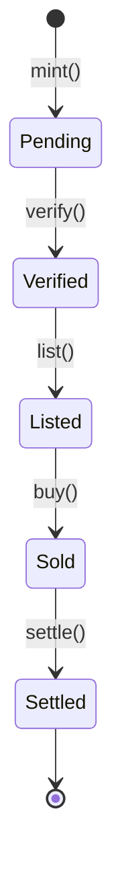

<p align="center">
  
  
  
  
  
  
</p>

<h1 align="center">
  🧾 ReceivAI
  <br/>
  <sub>Universal Invoice Settlement Protocol (UISP)</sub>
</h1>

<p align="center">
  <strong>AI-Powered Invoice Financing on Stellar Blockchain</strong>
</p>

<p align="center">
  <em>Transform invoices into tokenized digital assets • Unlock instant liquidity • Earn predictable yields</em>
</p>

<p align="center">
  
  
  
</p>

---

## 🌟 Overview

**ReceivAI** revolutionizes invoice financing by tokenizing business invoices as NFTs on the **Stellar blockchain**. With the **Universal Invoice Settlement Protocol (UISP)**, businesses unlock instant cash flow while investors access a new asset class with transparent, predictable yields.

### 💡 The Problem
SMEs wait 30-90 days for invoice payments, strangling cash flow and limiting growth.

### ✨ The Solution
ReceivAI tokenizes invoices on Stellar, enabling businesses to sell receivables at a discount for immediate cash, while investors purchase invoices for attractive risk-adjusted yields.

---

## 🏗️ Architecture

```
┌─────────────────────────────────────────────────────────────────────┐
│                        ReceivAI Platform                             │
├─────────────────────────────────────────────────────────────────────┤
│                                                                      │
│  ┌──────────────┐    ┌──────────────┐    ┌──────────────────────┐   │
│  │   Next.js    │───▶│   Stellar    │───▶│  UISP Smart Contract │   │
│  │   Frontend   │◀───│   Network    │◀───│     (Soroban/Rust)   │   │
│  └──────────────┘    └──────────────┘    └──────────────────────┘   │
│         │                                          │                 │
│         │           ┌──────────────┐              │                 │
│         └──────────▶│   Freighter  │◀─────────────┘                 │
│                     │    Wallet    │                                 │
│                     └──────────────┘                                 │
│                                                                      │
│  ┌──────────────────────────────────────────────────────────────┐   │
│  │                    AI Rule Engine                             │   │
│  │   • Cash flow optimization  • Smart pricing  • Alerts        │   │
│  └──────────────────────────────────────────────────────────────┘   │
│                                                                      │
└─────────────────────────────────────────────────────────────────────┘
```

---

## ✨ Features

<table>
<tr>
<td width="50%">

### 🔐 **Invoice Tokenization**
Mint invoices as NFTs with complete on-chain verification, provenance tracking, and ownership transfer.

### 🏪 **Decentralized Marketplace**
Browse, list, and purchase tokenized invoices with transparent pricing and real-time yield calculations.

### 🤖 **AI-Powered Insights**
Smart rule engine suggests optimal pricing, selling strategies, and cash flow optimization — no LLMs, pure deterministic logic.

</td>
<td width="50%">

### 👛 **Freighter Wallet**
Seamless Stellar wallet integration with real-time XLM balance display and auto-refresh every 30 seconds.

### 📊 **Analytics Dashboard**
Portfolio analytics with status breakdown, conversion rates, cash flow metrics, and average days to due.

### ⚡ **Complete Lifecycle**
Full invoice journey: Create → Verify → List → Buy → Settle with automated status tracking.

</td>
</tr>
</table>

---

## 📋 Invoice Lifecycle



| Status | Description | Who Can Act |
|--------|-------------|-------------|
| **Pending** | Invoice created, awaiting verification | Buyer verifies |
| **Verified** | Buyer confirmed authenticity | Seller lists |
| **Listed** | Available on marketplace | Investors buy |
| **Sold** | Ownership transferred to investor | Debtor settles |
| **Settled** | Payment complete | Terminal state |

---

## 🔧 Smart Contract Functions

The **UISP** contract (`CCHFONTRNCJ5RBA73GPPXEKKAUGV2Q5PMP2LZMNLDI45UHI3I5UTOHYE`) provides:

| Function | Description |
|----------|-------------|
| `mint()` | Create invoice NFT with seller, buyer, amount, due date |
| `verify()` | Buyer confirms invoice authenticity |
| `list()` | List invoice on marketplace with price |
| `buy()` | Purchase listed invoice, transfer ownership |
| `settle()` | Pay current holder when invoice is due |
| `get_invoice()` | Query single invoice by ID |
| `get_invoices_by_seller()` | Get all invoices for a seller |
| `get_all_listings()` | Fetch active marketplace listings |

---

## 🤖 AI Rule Engine

Deterministic, transparent recommendations — no hallucinations:

| Rule | Trigger | Action |
|------|---------|--------|
| **Low Balance Alert** | Cash < ₹10,000 | Suggest selling verified invoices |
| **Sell Suggestion** | Verified invoices exist | Calculate optimal discount (1-5%) |
| **Verification Reminder** | Pending > 3 days | Prompt to send reminder |
| **Early Payment Discount** | Due > 45 days | Suggest 2% early payment offer |

**Discount Logic:**
- Due in <15 days → 1% discount
- Due in 15-30 days → 2% discount
- Due in 30-45 days → 3% discount
- Due in 45-60 days → 4% discount
- Due in >60 days → 5% discount

---

## 📦 Tech Stack

| Layer | Technology |
|-------|------------|
| **Smart Contract** | Rust, Soroban SDK 22.0 |
| **Frontend** | Next.js 16, React 19, TypeScript |
| **Styling** | Tailwind CSS 4, Framer Motion |
| **Blockchain** | Stellar Testnet, Horizon API |
| **Wallet** | Freighter API v6 |
| **State** | React Context + localStorage |

---

## 🚀 Quick Start

### Prerequisites
- Node.js 18+
- Freighter browser extension
- (Optional) Rust + Stellar CLI for contract development

### Installation

```bash
git clone https://github.com/sukrit-89/RAI_UISP.git
cd RAI_UISP/receivai
npm install
npm run dev
```

Open [http://localhost:3000](http://localhost:3000) and connect your Freighter wallet.

### Smart Contract Development

```bash
cd contracts/uisp
cargo build --release --target wasm32-unknown-unknown
cargo test
```

---

## 📁 Project Structure

```
receivai/
├── contracts/uisp/           # Soroban smart contract (Rust)
│   └── src/
│       ├── lib.rs            # UISP contract implementation
│       └── test.rs           # Contract unit tests
├── src/
│   ├── app/                  # Next.js pages
│   │   ├── page.tsx          # Main dashboard
│   │   └── verify/[invoice]/ # Buyer verification page
│   ├── components/           # React components
│   │   ├── AIAgentPanel.tsx
│   │   ├── AnalyticsPanel.tsx
│   │   ├── BuyInvoiceModal.tsx
│   │   ├── CreateInvoiceModal.tsx
│   │   ├── ErrorBoundary.tsx
│   │   ├── InvoiceCard.tsx
│   │   ├── MarketplaceTab.tsx
│   │   ├── SellInvoiceModal.tsx
│   │   ├── Sidebar.tsx
│   │   └── TopBar.tsx
│   └── lib/                  # Core logic
│       ├── ai-rules.ts       # AI recommendation engine
│       ├── contract-client.ts # Soroban SDK wrapper
│       ├── error-handler.ts  # Centralized error handling
│       ├── invoice-store.ts  # State management
│       ├── types.ts          # TypeScript types
│       └── wallet-context.tsx # Freighter integration
└── public/
```

---

## � Implementation Status

| Component | Status | Notes |
|-----------|--------|-------|
| **Smart Contract** | ✅ 95% | Deployed to testnet, all functions working |
| **Frontend UI** | ✅ 95% | Modern UI with animations, responsive design |
| **AI Engine** | ✅ 100% | All 4 rules implemented, priority sorting |
| **Wallet Integration** | ✅ 95% | Real balance from Horizon, auto-refresh |
| **Analytics** | ✅ 100% | Full dashboard with cash flow metrics |
| **Error Handling** | ✅ 95% | Centralized system, user-friendly messages |
| **Demo Mode** | ✅ 100% | Works without Freighter/contract |

### 🚧 Future Enhancements
- Real-time WebSocket updates
- Multi-token support (stablecoins)
- Email/SMS notifications
- Batch invoice operations
- Real-time XLM/INR exchange rate

---

## 🛣️ Roadmap

- [x] **Phase 1** — UISP Smart Contract Development
- [x] **Phase 2** — Frontend Dashboard with Invoice Management  
- [x] **Phase 3** — Marketplace & AI Agent Integration
- [x] **Phase 4** — Analytics & Error Handling
- [ ] **Phase 5** — Mainnet Deployment
- [ ] **Phase 6** — Mobile App & API Expansion

---

## 📄 License

MIT License — see [LICENSE](LICENSE) for details.

---

<p align="center">
  <strong>Built with 💜 on Stellar</strong>
  <br/><br/>
  <a href="https://stellar.org">
    
  </a>
</p>
