<p align="center">
  
  
  
  
  
  
</p>

<h1 align="center">
  🧾 ReceivAI
  <br/>
  <sub>Universal Invoice Settlement Protocol</sub>
</h1>

<p align="center">
  <strong>Transform your invoices into tradeable digital assets on Stellar</strong>
</p>

<p align="center">
  <em>AI-powered invoice financing platform with blockchain-backed tokenization, real-time marketplace, and instant liquidity.</em>
</p>

---

## 🌟 Overview

**ReceivAI** is a next-generation invoice financing platform that enables businesses to convert their outstanding invoices into tokenized digital assets on the **Stellar blockchain**. By leveraging the **Universal Invoice Settlement Protocol (UISP)**, businesses can unlock instant liquidity, while investors gain access to a new asset class with predictable yields.

### The Problem
Small and medium businesses often wait 30-90 days for invoice payments, creating cash flow challenges that limit growth.

### The Solution
ReceivAI tokenizes invoices as NFTs on Stellar, allowing businesses to sell them at a discount for immediate cash, while investors can purchase invoices for attractive yields.

---

## ✨ Key Features

<table>
<tr>
<td width="50%">

### 🔐 **Invoice Tokenization**
Mint invoices as NFTs on Stellar with complete on-chain verification and provenance tracking.

### 🏪 **Decentralized Marketplace**
List, browse, and purchase tokenized invoices with transparent pricing and yield calculations.

### 🤖 **AI-Powered Insights**
Smart recommendation engine that suggests optimal pricing, selling strategies, and cash flow optimization.

</td>
<td width="50%">

### 👛 **Freighter Wallet Integration**
Seamless connection with Stellar's Freighter wallet for secure transactions and identity management.

### 📊 **Real-time Dashboard**
Comprehensive portfolio management with status tracking across the full invoice lifecycle.

### ⚡ **Instant Settlement**
Fast, low-cost settlements leveraging Stellar's 3-5 second finality.

</td>
</tr>
</table>

---

## 🏗️ Architecture

```
┌─────────────────────────────────────────────────────────────────┐
│                         ReceivAI Platform                        │
├─────────────────────────────────────────────────────────────────┤
│                                                                   │
│   ┌─────────────┐     ┌─────────────┐     ┌─────────────┐       │
│   │   Next.js   │────▶│   Stellar   │────▶│   Soroban   │       │
│   │   Frontend  │◀────│   Network   │◀────│   Contract  │       │
│   └─────────────┘     └─────────────┘     └─────────────┘       │
│         │                                        │               │
│         │              ┌─────────────┐          │               │
│         └─────────────▶│  Freighter  │◀─────────┘               │
│                        │   Wallet    │                           │
│                        └─────────────┘                           │
│                                                                   │
└─────────────────────────────────────────────────────────────────┘
```

---

## 📦 Tech Stack

| Layer | Technology |
|-------|------------|
| **Frontend** | Next.js 16, React 19, TypeScript, Tailwind CSS 4 |
| **Smart Contract** | Rust, Soroban SDK 22.0 |
| **Blockchain** | Stellar Testnet |
| **Wallet** | Freighter API |
| **UI/UX** | Framer Motion, Lucide Icons |

---

## 🚀 Getting Started

### Prerequisites

- **Node.js** 18+ 
- **Rust** (for contract development)
- **Freighter Wallet** browser extension
- **Stellar CLI** (optional, for contract deployment)

### Installation

```bash
# Clone the repository
git clone https://github.com/sukrit-89/RAI_UISP.git
cd RAI_UISP/receivai

# Install dependencies
npm install

# Run development server
npm run dev
```

Open [http://localhost:3000](http://localhost:3000) to view the application.

### Smart Contract Development

```bash
# Navigate to contracts
cd contracts/uisp

# Build the contract
cargo build --release --target wasm32-unknown-unknown

# Run tests
cargo test
```

---

## 📋 Invoice Lifecycle

```mermaid
graph LR
    A[🆕 Create] --> B[📝 Pending]
    B --> C[✅ Verified]
    C --> D[🏷️ Listed]
    D --> E[💰 Sold]
    E --> F[✓ Settled]
    
    style A fill:#6366f1,color:#fff
    style B fill:#f59e0b,color:#fff
    style C fill:#22c55e,color:#fff
    style D fill:#14b8a6,color:#fff
    style E fill:#8b5cf6,color:#fff
    style F fill:#10b981,color:#fff
```



| Status | Description |
|--------|-------------|
| **Pending** | Invoice created, awaiting buyer verification |
| **Verified** | Buyer confirmed the invoice is legitimate |
| **Listed** | Available for purchase on the marketplace |
| **Sold** | Purchased by an investor |
| **Settled** | Payment completed to the invoice holder |

---

## 🔧 Smart Contract Functions

The **UISP** smart contract provides the following core functions:

| Function | Description |
|----------|-------------|
| `mint()` | Create a new invoice NFT |
| `verify()` | Buyer verifies the invoice authenticity |
| `list()` | List invoice on the marketplace with price |
| `buy()` | Purchase a listed invoice |
| `settle()` | Settle payment to the current invoice holder |

---

## 🤖 AI Rule Engine

ReceivAI uses a rule-based AI engine (no LLMs) for smart recommendations:

- **📉 Low Balance Alerts** — Proactive warnings when cash reserves are low
- **💡 Sell Suggestions** — Optimal timing and pricing for invoice sales
- **📆 Verification Reminders** — Follow-up prompts for pending invoices
- **🎯 Early Payment Discounts** — Strategic discount suggestions to accelerate cash flow

---

## 📁 Project Structure

```
receivai/
├── contracts/
│   └── uisp/              # Soroban smart contract (Rust)
│       ├── src/
│       │   ├── lib.rs     # Main contract logic
│       │   └── test.rs    # Contract tests
│       └── Cargo.toml
├── src/
│   ├── app/               # Next.js app router pages
│   ├── components/        # React components
│   │   ├── AIAgentPanel.tsx
│   │   ├── BuyInvoiceModal.tsx
│   │   ├── CreateInvoiceModal.tsx
│   │   ├── InvoiceCard.tsx
│   │   ├── MarketplaceTab.tsx
│   │   └── ...
│   └── lib/               # Core logic & utilities
│       ├── ai-rules.ts    # AI recommendation engine
│       ├── contract-client.ts
│       ├── invoice-store.ts
│       ├── types.ts
│       └── wallet-context.tsx
├── public/
└── package.json
```

---

## 🛣️ Roadmap

- [x] **Phase 1** — UISP Smart Contract Development
- [x] **Phase 2** — Frontend Dashboard with Invoice Management
- [x] **Phase 3** — Marketplace Integration
- [ ] **Phase 4** — Mainnet Deployment
- [ ] **Phase 5** — Mobile App & API Expansion

---

## 🤝 Contributing

Contributions are welcome! Please feel free to submit a Pull Request.

1. Fork the repository
2. Create your feature branch (`git checkout -b feature/AmazingFeature`)
3. Commit your changes (`git commit -m 'Add some AmazingFeature'`)
4. Push to the branch (`git push origin feature/AmazingFeature`)
5. Open a Pull Request

---

## 📄 License

This project is licensed under the MIT License - see the [LICENSE](LICENSE) file for details.

---

<p align="center">
  <strong>Built with 💜 on Stellar</strong>
  <br/><br/>
  <a href="https://stellar.org">
    
  </a>
</p>
